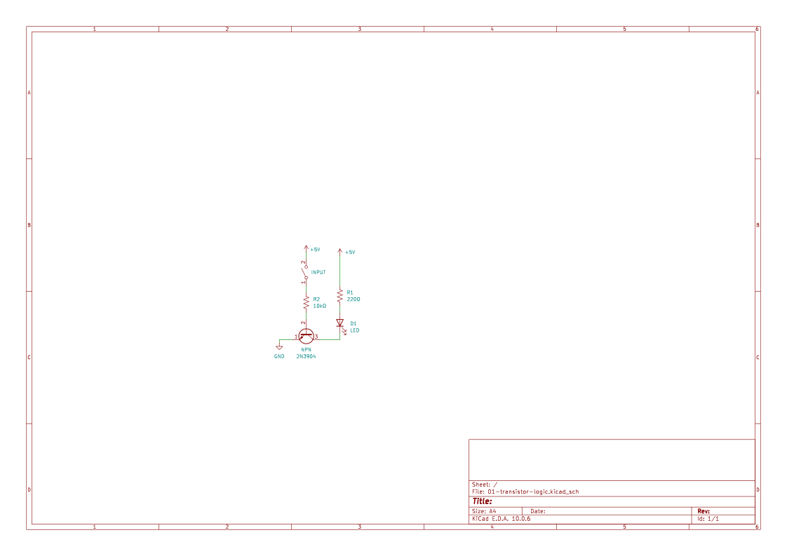
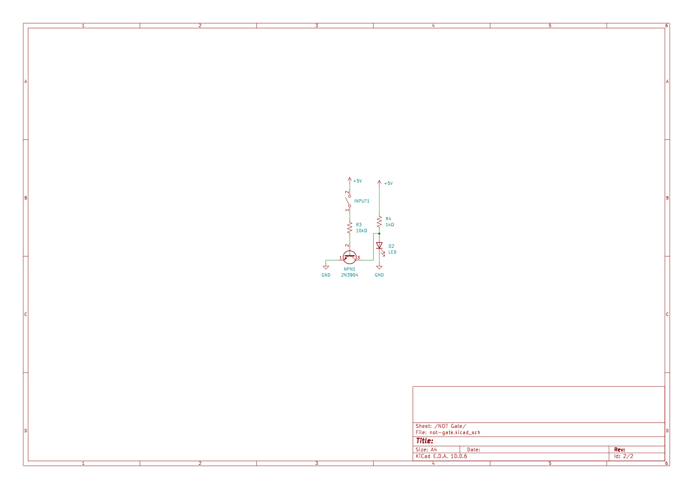

# Transistor Logic

## Goal

Understand how a transistor can act as an electronic switch and how that behavior can be used to implement digital logic.

We built:
- A transistor-controlled LED circuit
- A transistor-based NOT gate

## Build

### Transistor as a Switch

### NOT Gate

## How It Works

### Transistor as a Switch

The input controls the transistor's base. When the input is LOW, the transistor is off, so little current flows through the LED. When the input is HIGH, the transistor turns on and allows current to flow through the LED, making it light.

### NOT Gate

The NOT gate uses the transistor as an inverting switch. A LOW input leaves the transistor off and the output HIGH through the pull-up resistor. A HIGH input turns the transistor on and pulls the output LOW.

## What We Learned

- A transistor can act as an electronically controlled switch, turning current on or off based on its input.
- Combining a transistor with resistors lets us build a NOT gate that produces the opposite of its input.