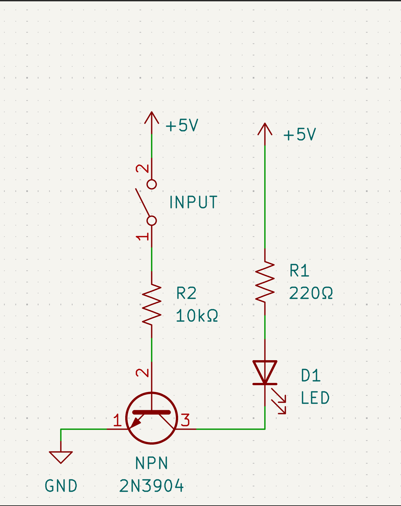
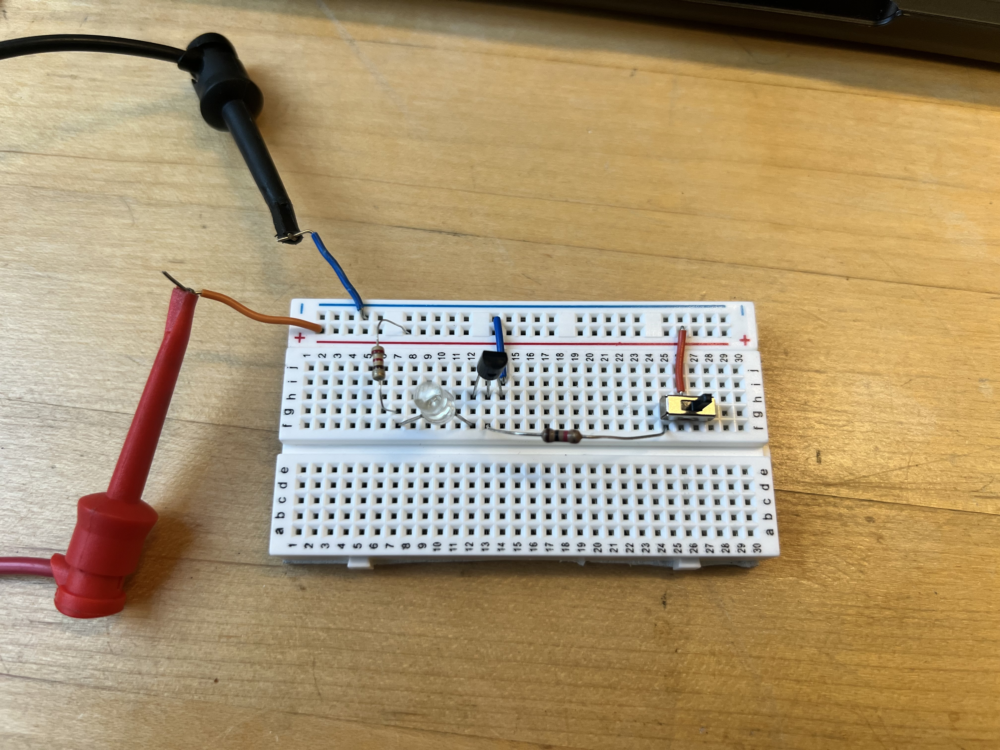
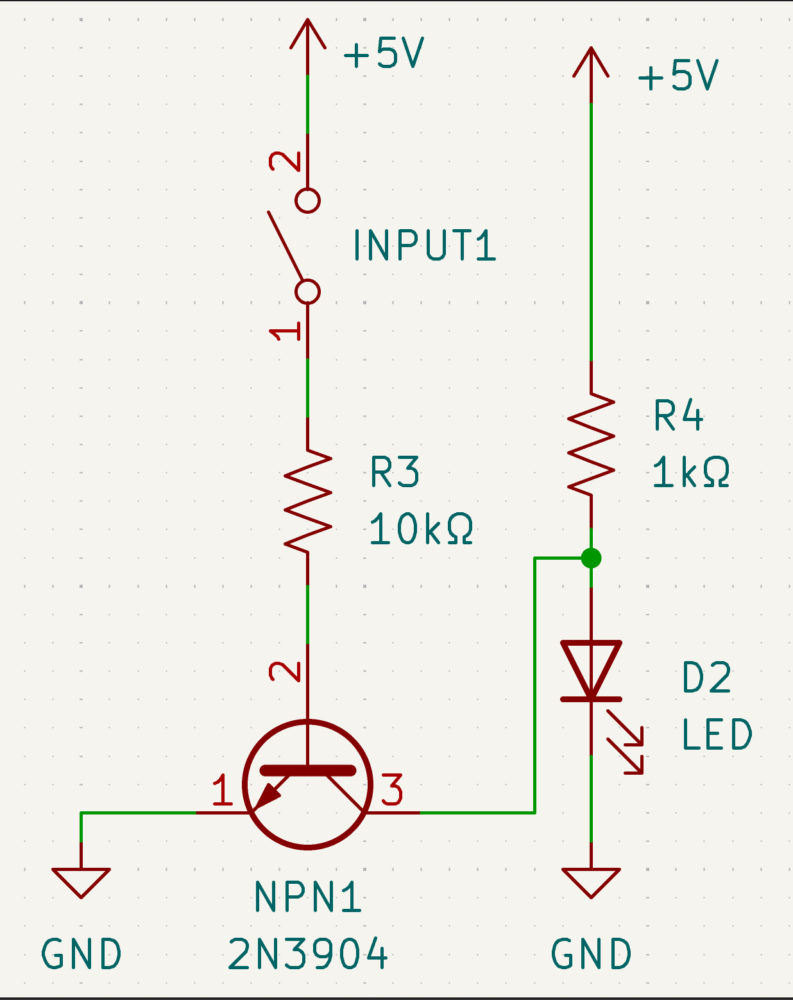
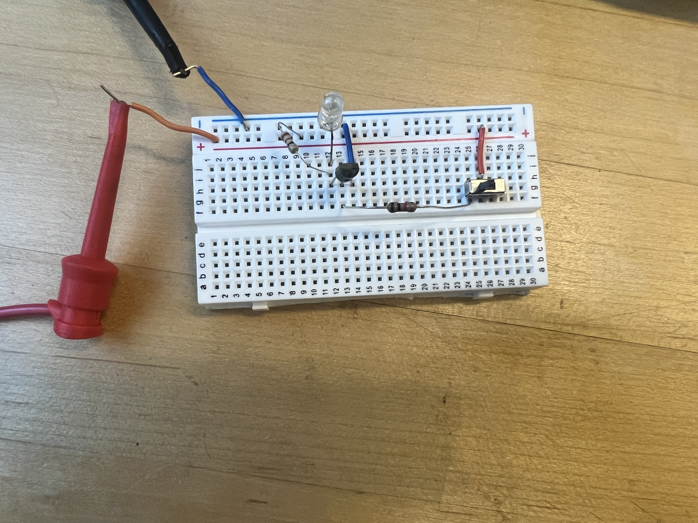
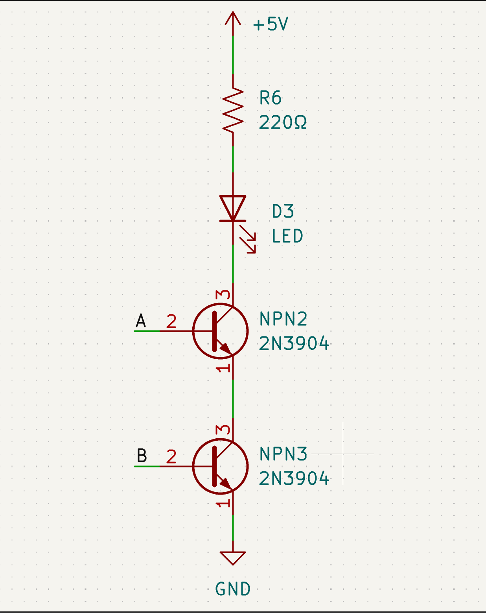
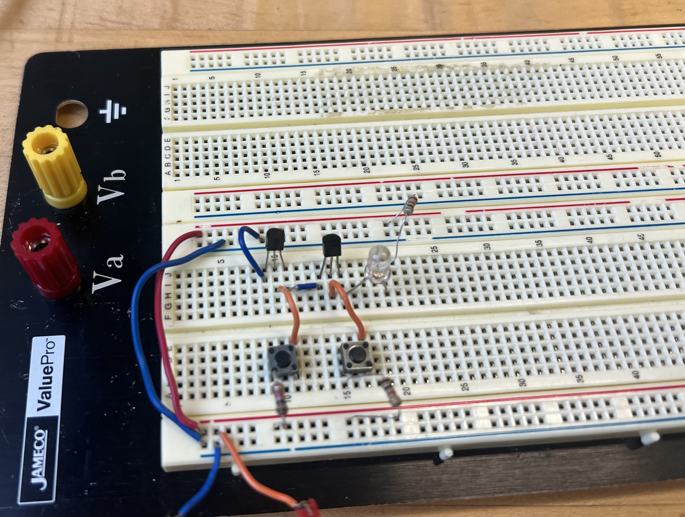

# Transistor Logic

## Goal

Understand how a transistor can act as an electronic switch and how that behavior can be used to implement digital logic.

## Transistor as a Switch

### Build

### How It Works

The input controls the transistor's base. When the input is LOW, the transistor is off, so little current flows through the LED. When the input is HIGH, the transistor turns on and allows current to flow through the LED, making it light.

## NOT Gate

### Build

### How It Works

The NOT gate uses the transistor as an inverting switch. A LOW input leaves the transistor off and the output HIGH through the pull-up resistor. A HIGH input turns the transistor on and pulls the output LOW.

## AND Gate

### Build

### How It Works

The two transistors are connected in series, so current can flow through the LED only when both inputs are HIGH and both transistors turn on. If either input is LOW, its transistor stays off and the LED remains off.

## What We Learned

- A transistor can act as an electronically controlled switch, turning current on or off based on its input.
- Combining a transistor with resistors lets us build a NOT gate that produces the opposite of its input.